# CabCast

Zone-level demand forecasting for New York City taxis, with calibrated uncertainty and an
optimal-transport rebalancing policy, packaged as a reproducible production ML system.

[](https://github.com/adwitiyashukla/cabcast/actions/workflows/ci.yml)


Built on **89,892,322 real NYC yellow-taxi trips** (2024-01-15 to 2025-12-31), the official TLC taxi
zone shapefile, and hourly Central Park weather.

A dispatcher needs three answers, and a point forecast only gives the first:

1. **How many pickups will each zone see next hour?** Gradient boosting over 91
   engineered features cuts MAE **59.8%** against a seasonal-naive baseline.
2. **How wrong could that be?** Conformal prediction turns the forecast into an interval with a
   distribution-free finite-sample coverage guarantee, hitting 0.8994
   against a 90% target.
3. **So what should the fleet do?** The forecast becomes the demand marginal of an entropic
   optimal-transport problem, removing **46%** of unmet demand under
   a realistic repositioning budget.

There is also a fourth answer, and it is the most interesting one: **a causal question this data
cannot answer**, documented below rather than hidden.

101 tests and an end-to-end pipeline run guard all of it in CI on four Python versions.

---

## Architecture

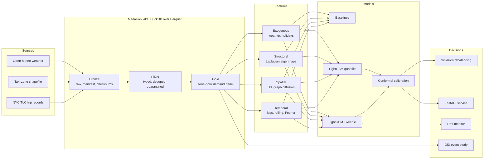

---

## The data

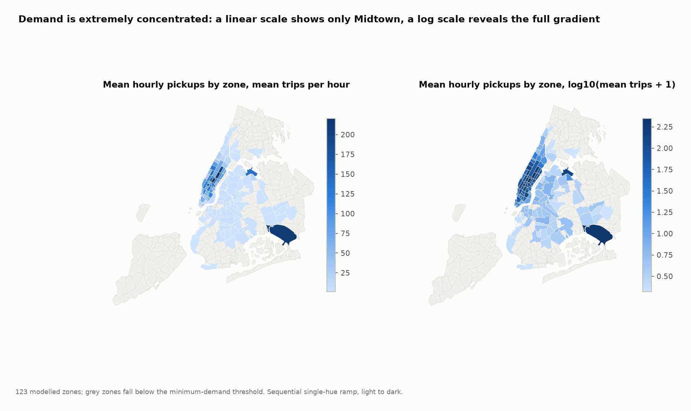

Yellow-taxi demand spans orders of magnitude across zones. On a linear scale you see only Midtown;
on a log scale the real gradient appears. This is why the model uses a Tweedie objective rather
than squared error, and why the uncertainty layer has to be conditional rather than one global band.

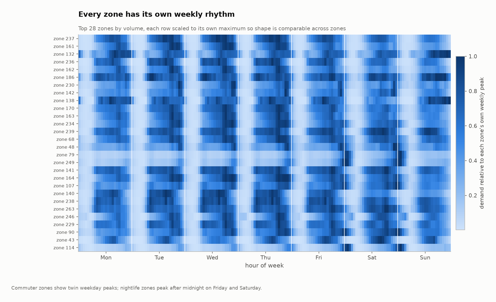

Each row is scaled to its own weekly peak so shape is comparable across zones of very different
volume. Commuter zones show twin weekday peaks, nightlife zones light up after midnight on Friday
and Saturday, and airport zones follow flight banks rather than the commute.

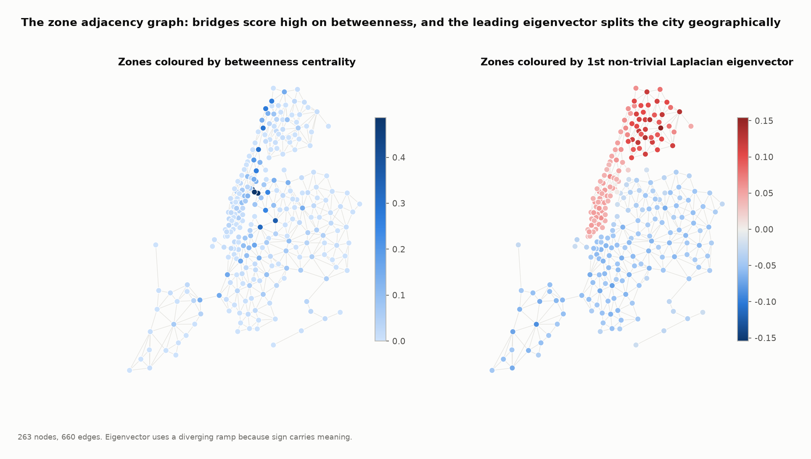

Taxi zones form a planar adjacency graph, and two things computed from it become model features:
**betweenness centrality**, which peaks on the bridge and tunnel zones that funnel traffic, and the
**eigenvectors of the normalised graph Laplacian**, a continuous positional encoding of where a
zone sits in the city. The leading non-trivial eigenvector splits the city geographically without
ever being shown a coordinate.

### Quality gate

The silver layer never silently drops a row. Every rejection is counted by reason, written to
`reports/quality_silver.json`, and the stage refuses to continue if dropped rows do not reconcile
against rule-matched rows. Of 89,892,322 raw trips, 6,440,532
(7.17%) were quarantined:

| rejection reason | rows | share |
|---|---|---|
| fare out of range | 3,579,676 | 3.982% |
| distance too short | 2,614,539 | 2.909% |
| negative total | 1,583,065 | 1.761% |
| duration too short | 1,383,265 | 1.539% |
| nonpositive duration | 559,814 | 0.623% |
| duration too long | 36,939 | 0.041% |
| distance too long | 3,577 | 0.004% |
| negative tip | 3,024 | 0.003% |
| outside month window | 59 | 0.000% |

123 zones clear the minimum-demand threshold and carry geometry. TLC location
id 264
("Unknown" in the lookup table) receive plenty of
trips but appear in no shapefile, so they are excluded from spatial modelling and logged rather
than silently null-joined.

---

## Forecast accuracy

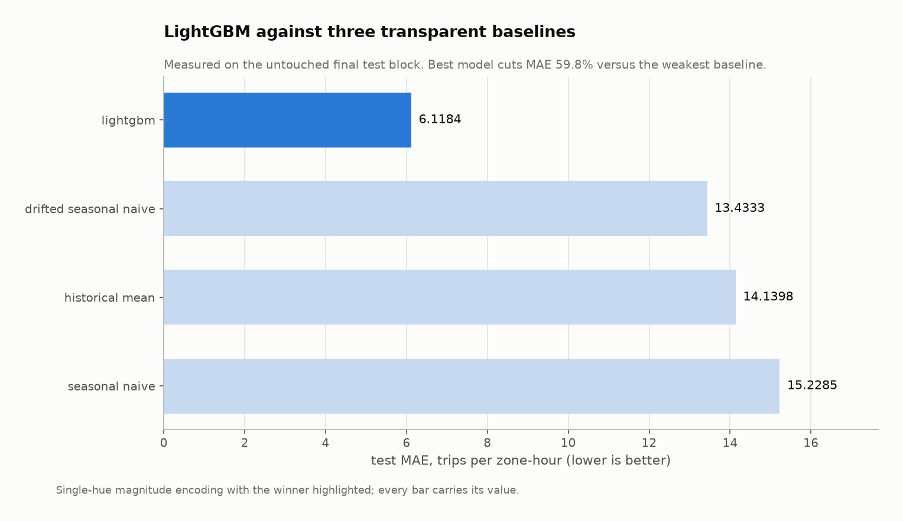

Measured on the final 82,656-row test block, held out from the start and
scored exactly once.

| model | MAE | RMSE | MASE | bias |
|---|---|---|---|---|
| seasonal naive | 15.229 | 36.895 | 1.000 | +1.769 |
| drifted seasonal naive | 13.433 | 31.562 | 0.882 | +0.415 |
| historical mean | 14.140 | 31.416 | 0.929 | -4.813 |
| lightgbm | 6.118 | 12.860 | 0.402 | -0.586 |

LightGBM cuts MAE **59.8%** against seasonal naive. MASE of
0.402 means it beats a one-week-ago naive forecast by roughly a factor of
two and a half on its own scale.

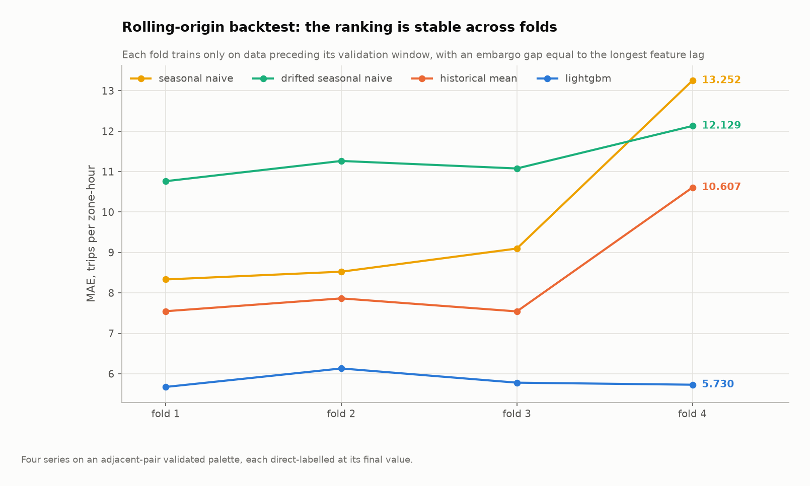

| fold | train rows | seasonal naive | historical mean | LightGBM |
|---|---|---|---|---|
| fold 1 | 1,827,288 | 8.333 | 7.548 | 5.675 |
| fold 2 | 1,868,616 | 8.525 | 7.865 | 6.132 |
| fold 3 | 1,909,944 | 9.098 | 7.543 | 5.780 |
| fold 4 | 1,951,272 | 13.252 | 10.607 | 5.730 |

Each fold trains only on data strictly before its validation window, separated by a 336-hour
embargo equal to the longest feature lag. Without that gap the two-week lag features would let
training rows see their own validation targets. `assert_temporal_integrity` enforces it on every
run and a test asserts that a deliberately short embargo fails.

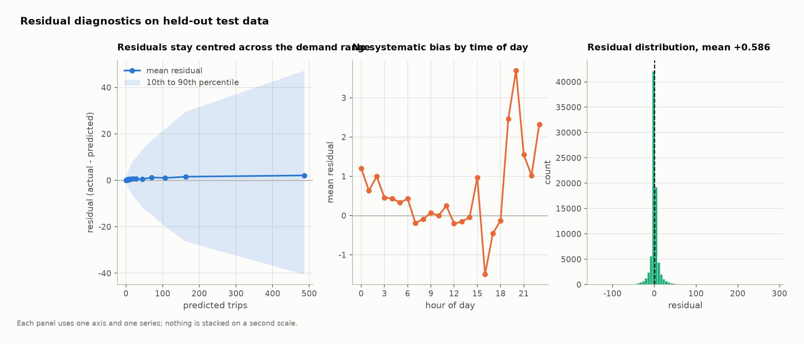

---

## Uncertainty

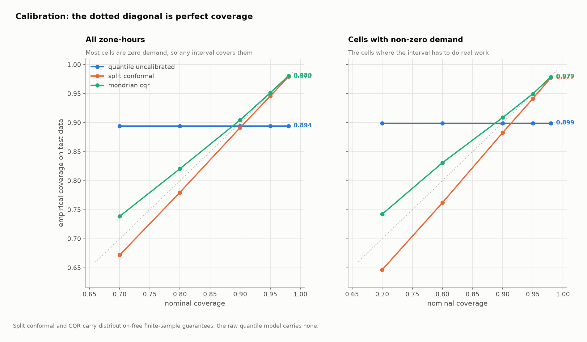

| method | coverage | coverage, non-zero cells | mean width | Winkler |
|---|---|---|---|---|
| quantile uncalibrated | 0.8943 | 0.8992 | 29.49 | 38.82 |
| conformalized quantile | 0.8994 | 0.9002 | 29.53 | 38.81 |
| mondrian cqr | 0.9047 | 0.9088 | 30.34 | 38.78 |
| split conformal | 0.8916 | 0.8828 | 23.17 | 57.63 |

Target coverage is 90%. Raw quantile regression
under-covers at 0.8943; conformalising it lands on
0.8994. That correction is distribution-free and holds in
finite samples, assuming only exchangeability.

Winkler score is the column that separates the two conformal variants, because it charges for
width as well as misses. Split conformal produces a **constant-width** interval and scores
57.63. Mondrian CQR produces an **adaptive-width** interval and
scores 38.78, **33% better**. A band that is narrow in
quiet zones and wide in Midtown is worth far more to a dispatcher than one that is uniformly wide.

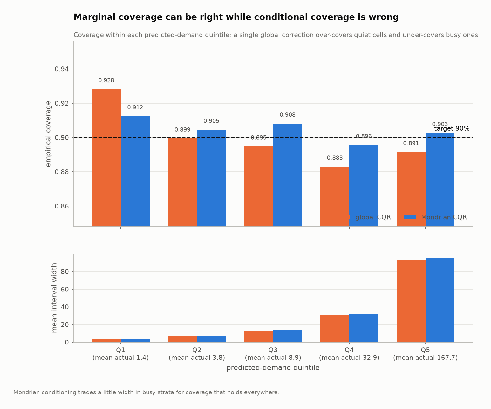

Marginal coverage can be right while the model is wrong where it matters. Split by
predicted-demand quintile:

| quintile | mean actual trips | global CQR | Mondrian CQR |
|---|---|---|---|
| Q1 | 1.4 | 0.9281 | 0.9124 |
| Q2 | 3.8 | 0.8995 | 0.9045 |
| Q3 | 8.9 | 0.8949 | 0.9081 |
| Q4 | 32.9 | 0.8831 | 0.8956 |
| Q5 | 167.7 | 0.8915 | 0.9027 |

Coverage spread across quintiles is **0.0451** for a single global correction and
**0.0168** once the correction is conditioned on the demand stratum, a
63% reduction.

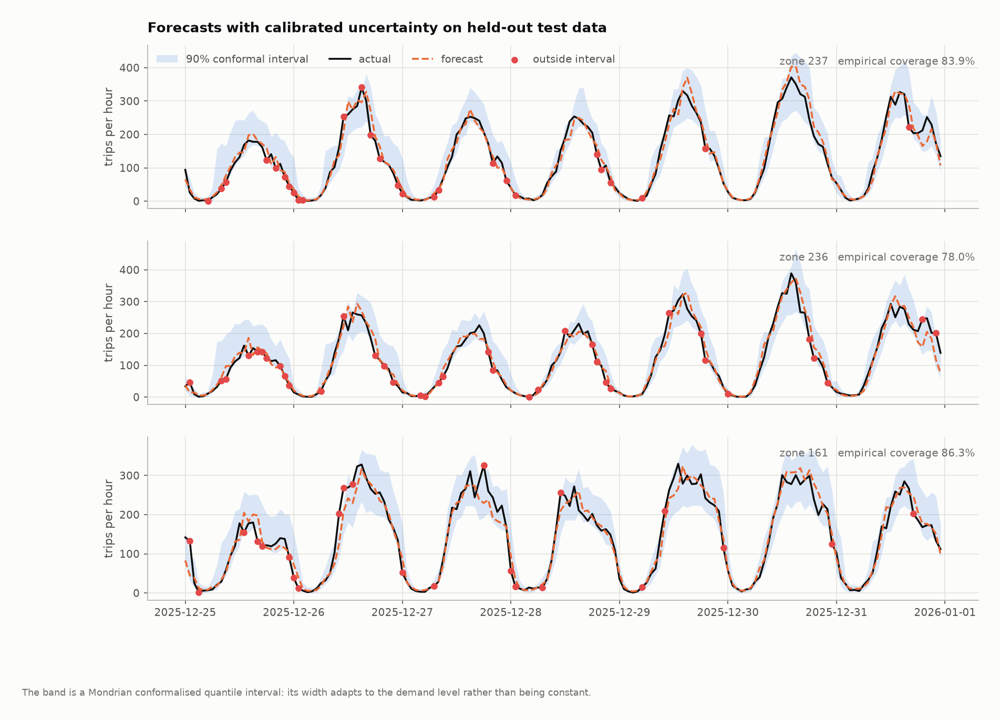

---

## From forecast to decision

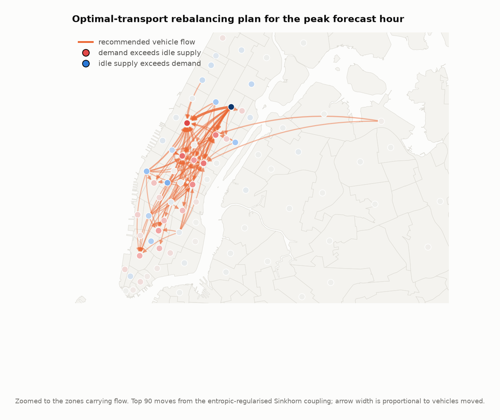

The forecast is the demand marginal, idle vehicles are the supply marginal, and inter-zone travel
time is the ground cost. Sinkhorn solves the entropic-regularised transport problem in log space,
converging to a marginal error of 8.4e-10 in
16 iterations.

A raw transport plan satisfies the demand marginal by construction, so scoring it against demand
would always report a perfect result. Two operational constraints make the number mean something:
at most **25%** of the idle fleet may reposition, and only vehicles that
can arrive within **30 minutes** count as supply.

Under those constraints, at the peak forecast hour a 2,500 vehicle idle fleet
cuts unmet demand from **607** to **326** trips, a
**46.3% reduction**, spending
18.6 vehicle-minutes per additional trip served.
551 vehicles move and 59 are stranded by the
arrival horizon.

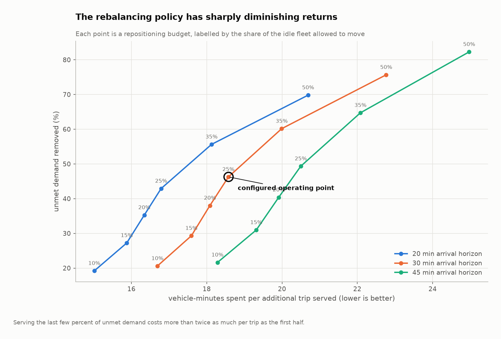

| repositioning budget | unmet demand removed | vehicle-minutes per extra trip | stranded |
|---|---|---|---|
| 10% | 20.6% | 16.7 | 24 |
| 15% | 29.3% | 17.6 | 36 |
| 20% | 38.0% | 18.1 | 48 |
| 25% | 46.3% | 18.6 | 59 |
| 35% | 60.2% | 20.0 | 82 |
| 50% | 75.7% | 22.8 | 102 |

The frontier is the actual operational result: the first half of unmet demand is cheap to serve and
the last few percent cost more than twice as much per trip. Sweeping the budget turns a solver
output into a decision a fleet manager can price.

The Sinkhorn implementation is validated against an exact linear-programming solution in
`tests/test_optimize.py`: the entropic solution upper-bounds the true optimum and converges toward
it as the regularisation shrinks.

---

## What drives the forecast

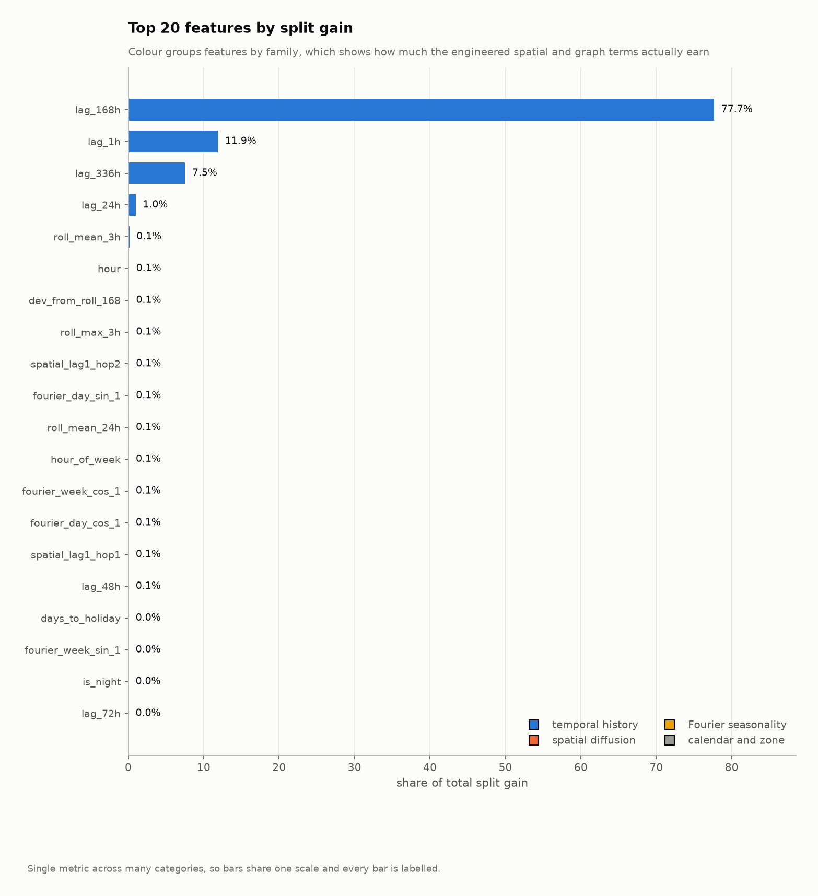

| feature | share of split gain |
|---|---|
| `lag_168h` | 77.68% |
| `lag_1h` | 11.89% |
| `lag_336h` | 7.54% |
| `lag_24h` | 0.99% |
| `roll_mean_3h` | 0.15% |
| `hour` | 0.11% |
| `dev_from_roll_168` | 0.10% |
| `roll_max_3h` | 0.09% |
| `spatial_lag1_hop2` | 0.09% |
| `fourier_day_sin_1` | 0.08% |

The weekly lag dominates, which is the honest answer for this target: taxi demand is
overwhelmingly a weekly-periodic process. The engineered spatial and graph terms earn a small but
non-zero share on top of it.

---

## The causal question this data cannot answer

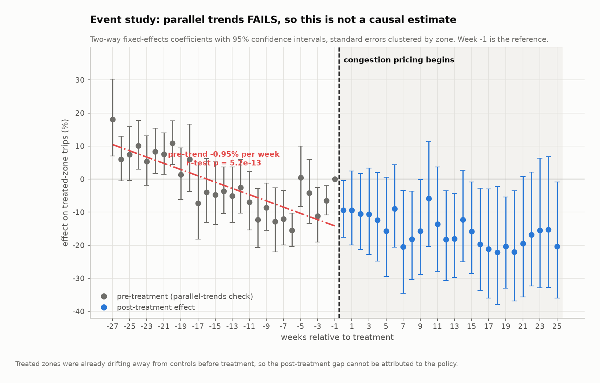

New York switched on its Congestion Relief Zone on 5 January 2025. Zones inside the charging area
are treated; comparable Manhattan zones above 60th Street are the control. Difference-in-differences
is the obvious tool, and it gives a clean, publishable-looking answer:

> Congestion pricing reduced taxi trips in the charging zone by **-14.36%**
> (95% CI -24.51% to -2.85%, p = 0.016).

**That number is not trustworthy, and the pipeline says so.**

Difference-in-differences rests on parallel trends: absent the policy, treated and control zones
would have moved together. That is testable, and here it fails badly:

| diagnostic | value |
|---|---|
| pre-trend joint F-test | p = 5.15e-13 |
| pre-trend slope | -0.95% per week |
| pre-periods individually significant | 46% |

Treated zones were already drifting away from controls at about 1% a week for six months **before
the policy existed**. Re-estimating with zone-specific linear time trends, which absorb that drift:

| specification | estimate | 95% CI | p |
|---|---|---|---|
| two-way fixed effects | -14.36% | -24.51% to -2.85% | 0.016 |
| plus zone-specific trends | +1.77% | -5.30% to +9.37% | 0.633 |

The effect goes from large and significant to **indistinguishable from zero**. Almost all of the
apparent impact was the pre-existing divergence continuing through the treatment date.

`run_congestion_pricing_study` computes the parallel-trends verdict on every run, refuses to label
a violated design as causal, automatically fits the trend-adjusted specification, and reports both.
A test plants a known pre-trend and asserts the detector catches it and that the adjusted estimate
lands closer to truth than the naive one.

The zone-trend design is rank deficient, so one collinear nuisance column is absorbed by the
solver; the standard error on the treatment term remains finite and clustered by zone, which the
pipeline checks explicitly rather than assuming.

**A better design would be needed to answer this question**: a synthetic control built from a
donor pool, or an approach that does not assume the two groups were on a common path. That is out
of scope here. What is in scope is refusing to report a number the data does not support.

---

## Production concerns

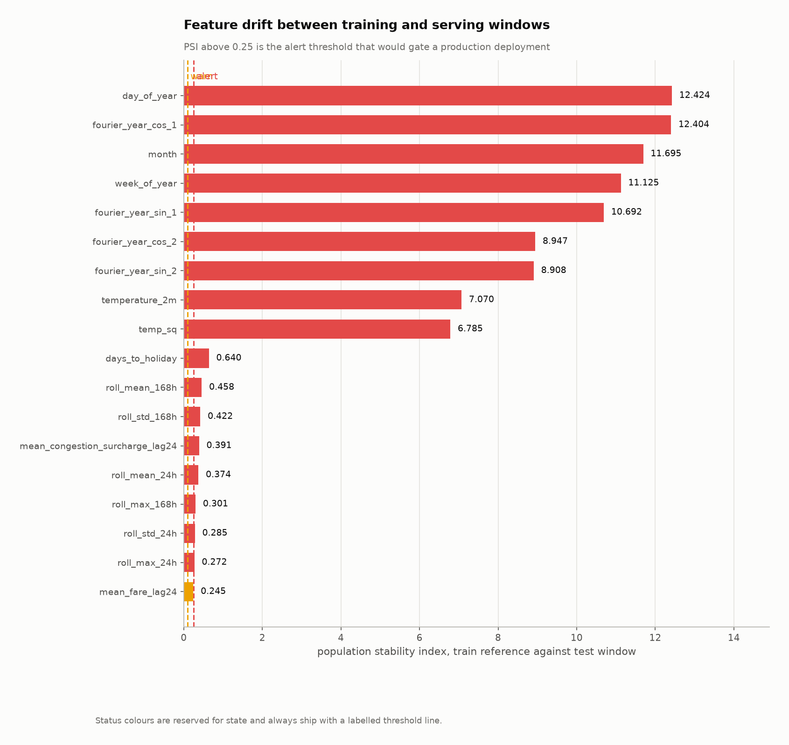

91 features are compared between the training reference window and
the serving window using population stability index and a two-sample Kolmogorov-Smirnov test.
17 sit at alert level, and **all of them are calendar or seasonal**:
`day_of_year`, `month`, `week_of_year` and the yearly Fourier terms necessarily drift when the
serving window is a different season. That is expected drift, not model decay. The number that
would gate a deployment is prediction drift, at PSI 0.1927
(ok).

### The API

```
make serve
```

```
curl -X POST localhost:8000/forecast \
  -H "content-type: application/json" \
  -d '{"hour_ts": "2025-12-31 18:00:00", "zone_ids": [161, 237, 236]}'
```

`POST /rebalance` returns the transport plan for an hour, `GET /model/card` returns the model card
including git SHA, training row count and best iteration, and `GET /health` reports which models
are loaded. Interactive docs at `localhost:8000/docs`.

---

## Running it

Python 3.10 or newer.

```
git clone https://github.com/adwitiyashukla/cabcast.git
cd cabcast
pip install -e ".[serve,dev]"
make all
```

`make all` downloads the real TLC data, builds every layer, trains and back-tests, calibrates the
intervals, solves the transport problem, runs the causal study and writes every figure. It falls
back to a built-in generator when the network is unavailable, and **says so loudly** rather than
silently substituting synthetic geometry.

| command | what it does |
|---|---|
| `make data` | download real NYC TLC trip records |
| `make silver` | clean and validate trips |
| `make gold` | build the zone-hour demand panel |
| `make train` | train and back-test |
| `make report` | regenerate every figure and results file |
| `cabcast report --reuse` | re-report from saved models without retraining |
| `make test` | run the test suite |
| `make serve` | start the API on port 8000 |

Any configuration value can be overridden without editing the file:

```
python -m cabcast.cli all --set model.lgbm.num_leaves=64 --set geo.min_daily_trips=25
```

**Memory.** The pipeline holds one float32 matrix and takes zero-copy slices of it for every fold,
because the feature frame is sorted time-major so a fold is a slice rather than a copy. That is
what lets 2,116,584 rows by 91 features train in roughly 4 GB instead
of the 8 GB-plus a naive pandas implementation needs.

---

## Layout

```
cabcast/
  conf/config.yaml            every tunable in one file
  src/cabcast/
    config.py                 layered config with dotted overrides
    cli.py                    pipeline entry points
    data/                     bronze ingestion, silver cleaning, gold panel, offline generator
    quality/                  schema contracts and expectation checks
    geo/                      zone geometry, H3 indexing, adjacency graph, Laplacian eigenmaps
    features/                 leakage-safe feature construction
    models/                   baselines, LightGBM, conformal calibration, model registry
    evaluation/               metrics, rolling-origin backtesting
    optimize/                 Sinkhorn optimal transport and rebalancing evaluation
    causal/                   difference-in-differences with parallel-trends diagnostics
    monitoring/               PSI and KS drift detection
    serving/                  FastAPI application and response schemas
    viz/                      figure generation
    pipelines/                training, reporting and summary orchestration
  tests/                      unit and end-to-end tests
  reports/                    generated results, quality reports and figures
  .github/workflows/ci.yml    lint, tests on four Python versions, end-to-end smoke run
```

---

## Testing

```
make test
```

101 tests, aimed at the parts most likely to be quietly wrong. Several exist because they
caught a real bug in this codebase:

- **Leakage.** Lag and rolling columns are checked against a manual shift, and the guard is asserted
  to raise.
- **Temporal integrity.** Fold windows must not overlap and must respect the embargo; a
  deliberately short embargo is asserted to fail.
- **SQL null semantics.** `WHERE NOT (a OR b)` silently drops rows when any term is NULL. Tests
  assert every dropped row is attributed to a named rule, and that no rule expression can evaluate
  to NULL. This one was found on real data after it silently discarded ten percent of trips.
- **Zone geometry.** Location ids present in trip data but absent from the shapefile must be
  excluded, not null-joined.
- **Conformal coverage.** Empirical coverage must land near nominal, tighter alpha must widen the
  interval, and Mondrian must reduce conditional-coverage spread.
- **Optimal transport.** Plan marginals must match supply and demand, cost must upper-bound an
  exact LP solution, and shrinking the regularisation must move it toward that optimum.
- **Parallel trends.** A planted pre-trend must be detected, and the trend-adjusted estimate must
  land closer to the true effect than the naive one.
- **End to end.** A miniature pipeline runs in a temporary directory and every declared figure,
  model card and quality report is asserted to exist.

CI runs lint, the suite on Python 3.10 through 3.13, and a full pipeline smoke run that boots the
API against the artifacts it just trained.

---

## License

MIT. See `LICENSE`.
